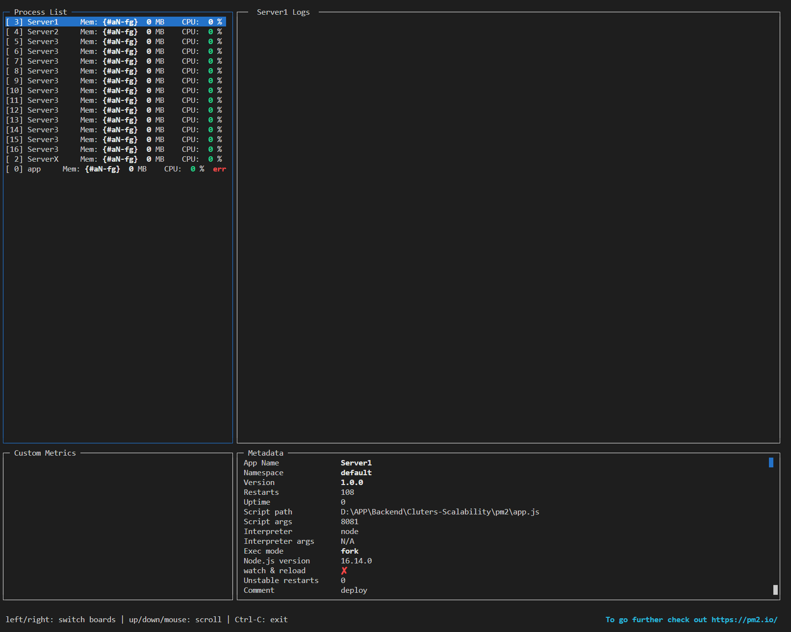
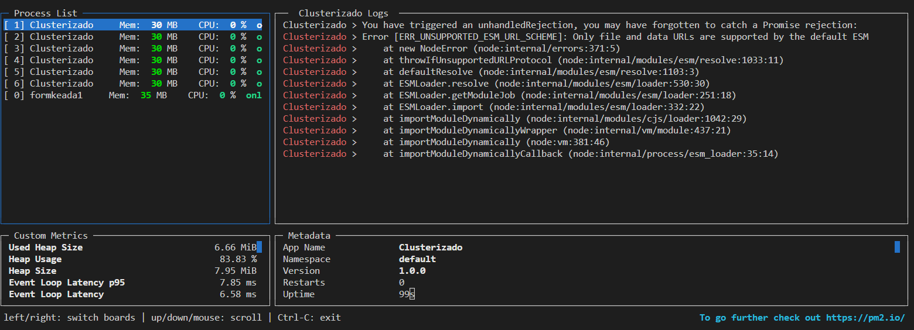

# cluster-scalability

<p align="center">
  <p align="center">    
        
  </p>
  <p align="center">
       CoderHouse - Backend
  </p>
</p>


Windows
https://norfipc.com/comandos/como-usar-comandos-tasklist-taskkill-windows.php


# ¿Qué es Cluster?
* Cuando hablamos de Cluster nos referimos al uso de subprocesos que permite aprovechar la capacidad del procesador del servidor donde se ejecute la aplicación.
* Como vimos la clase pasada, Node se ejecuta en un solo proceso (single thread), y entonces no aprovechamos la máxima capacidad que nos puede brindar un procesador multicore (múltiples núcleos).
* Al usar el cluster, lo que hacemos es, en el caso de estar ejecutando sobre un servidor multicore, hacer uso de todos los núcleos del mismo, aprovechando al máximo su capacidad.

# ¿Cómo funciona?
* Node nos provee un módulo llamado cluster para hacer uso de esto. El mismo, permite crear fácilmente procesos hijo.
* Lo que hace es clonar el worker maestro y delegarle la carga de trabajo a cada uno de ellos, de esa manera se evita la sobrecarga a un solo núcleo del procesador.
* Con un método similar al que vimos de Fork, se crea una copia del proceso actual. En ese momento, el primer proceso se convierte en maestro o master, y la copia en un trabajador o worker.

Utilizando directamente cluster como libreria del NodeJS

## Utilizando NodeJS

si utilizamos WINDOWS : 
si usamos Powershell: ista todos los procesos de node.js activos
```bash
tasklist /fi "imagename eq node.exe"
```
mata un proceso por su número de PID
```bash
taskkill /pid <PID> -f
```
Si usamos Bash: lista todos los procesos de node.js activos
```bash
fuser <PORT>/tcp [-k]
encuentra [y mata] al proceso ocupando el puerto PORT
```
En resumen tenemos : Utilizando : `import cluster from 'cluster';`
```bash
    tasklist /fi "imagename eq node.exe"
    taskkill /pid [Process Id] -f
```
si utilizamos Linux o Unix : [ver mas](https://www.hostinger.com/tutorials/vps/how-to-manage-processes-in-linux-using-command-line)
```bash
    ps -axjf
```

## Utilizando pm2 
[ver mas](https://www.npmjs.com/package/pm2)
[ver mas](https://lisk.com/documentation/lisk-service/configuration/source.html)

* Es un gestor de procesos (Process Manager), es decir, un programa que controla la ejecución de otro proceso. 
* Permite chequear si el proceso se está ejecutando, reiniciar el servidor si este se detiene por alguna razón, gestionar los logs, etc. 
* Lo más importante es que PM2 simplifica las aplicaciones de Node para ejecutarlas como cluster.
* Es decir, que podemos escribir nuestra aplicación sin pensar en el cluster, y luego PM2 se encarga de crear un número dado de worker processes para ejecutar la aplicación.
* Es capaz de aguantar cantidades enormes de tráfico con un consumo de recursos realmente reducido y con herramientas que permiten realizar la monitorización de las aplicaciones de manera remota.
* La ventaja principal sobre el módulo forever es el tema del cluster embebido en este módulo, como mencionamos antes.
* Para empezar a utilizarlo, podemos instalarlo hacemos
- Global
```bash
npm install pm2 -g
```
- Iniciar pm2
```bash
pm2 start pm2/app.js
```
- Se puede iniciar la ejecución en modo fork o en modo cluster. Los comandos que utilizamos son:
Modo fork: abris uno a la vez. Definis puertos manualmente. No pueden coincidir. No hay balance de carga (se debe hacer aparte)
Modo cluster: abris muchos a la vez. Definis 1 puerto compartido por todas las instancias. PM2 hace el balance de carga


```bash
[PM2] Starting D:\APP\Backend\Cluters-Scalability\pm2\app.js in fork_mode (1 instance)
[PM2] Done.
┌─────┬────────┬─────────────┬─────────┬─────────┬──────────┬────────┬──────┬───────────┬──────────┬──────────┬──────────┬──────────┐
│ id  │ name   │ namespace   │ version │ mode    │ pid      │ uptime │ ↺    │ status    │ cpu      │ mem      │ user     │ watching │
├─────┼────────┼─────────────┼─────────┼─────────┼──────────┼────────┼──────┼───────────┼──────────┼──────────┼──────────┼──────────┤
│ 0   │ app    │ default     │ 1.0.0   │ fork    │ 24068    │ 0      │ 1    │ stopped   │ 0%       │ 0b       │ Jesus    │ disabled │
└─────┴────────┴─────────────┴─────────┴─────────┴──────────┴────────┴──────┴───────────┴──────────┴──────────┴──────────┴──────────┘
```

pm2 start pm2/app.js --name appNUEVA.js
```bash
[PM2] Applying action restartProcessId on app [appNUEVA.js](ids: [ 1 ])
[PM2] [appNUEVA.js](1) ✓
[PM2] Process successfully started
┌─────┬────────────────┬─────────────┬─────────┬─────────┬──────────┬────────┬──────┬───────────┬──────────┬──────────┬──────────┬──────────┐
│ id  │ name           │ namespace   │ version │ mode    │ pid      │ uptime │ ↺    │ status    │ cpu      │ mem      │ user     │ watching │
├─────┼────────────────┼─────────────┼─────────┼─────────┼──────────┼────────┼──────┼───────────┼──────────┼──────────┼──────────┼──────────┤
│ 0   │ app            │ default     │ 1.0.0   │ fork    │ 0        │ 0      │ 15   │ errored   │ 0%       │ 0b       │ Jesus    │ disabled │
│ 1   │ appNUEVA.js    │ default     │ 1.0.0   │ fork    │ 3400     │ 0      │ 16   │ stopped   │ 0%       │ 0b       │ Jesus    │ disabled │
└─────┴────────────────┴─────────────┴─────────┴─────────┴──────────┴────────┴──────┴───────────┴──────────┴──────────┴──────────┴──────────┘
```


Modo FORK : Hace referencia a que va a ser un proceso desde CERO. eso quiere decir no permitira levantar multiples instancias despues de haber iniciado .
```bash
pm2 start pm2/app.js --name="ServerX" --watch -- PORT
pm2 start pm2/app.js --name="Server1" --watch -- 8081
pm2 start pm2/app.js --name="Server1" --watch -- 8082
pm2 start pm2/app.js --name="Server2" --watch -- 8082
pm2 start pm2/app.js --name="Server1" --watch -- 8081
```
Modo CLUSTER
```bash
pm2 start pm2/app.js --name="ServerX" --watch -i max -- PORT
pm2 start pm2/app.js --name="Server3" --watch -i max -- 8083
```

```bash
pm2 list
┌─────┬────────────────┬─────────────┬─────────┬─────────┬──────────┬────────┬──────┬───────────┬──────────┬──────────┬──────────┬──────────┐
│ id  │ name           │ namespace   │ version │ mode    │ pid      │ uptime │ ↺    │ status    │ cpu      │ mem      │ user     │ watching │
├─────┼────────────────┼─────────────┼─────────┼─────────┼──────────┼────────┼──────┼───────────┼──────────┼──────────┼──────────┼──────────┤
│ 3   │ Server1        │ default     │ 1.0.0   │ fork    │ 0        │ 0      │ 45   │ errored   │ 0%       │ 0b       │ Jesus    │ enabled  │
│ 4   │ Server2        │ default     │ 1.0.0   │ fork    │ 0        │ 0      │ 15   │ errored   │ 0%       │ 0b       │ Jesus    │ enabled  │
│ 5   │ Server3        │ default     │ 1.0.0   │ cluster │ 35540    │ 52s    │ 0    │ online    │ 0%       │ 31.1mb   │ Jesus    │ enabled  │
│ 6   │ Server3        │ default     │ 1.0.0   │ cluster │ 3328     │ 52s    │ 0    │ online    │ 0%       │ 30.8mb   │ Jesus    │ enabled  │
│ 7   │ Server3        │ default     │ 1.0.0   │ cluster │ 55644    │ 52s    │ 0    │ online    │ 0%       │ 31.2mb   │ Jesus    │ enabled  │
│ 8   │ Server3        │ default     │ 1.0.0   │ cluster │ 61264    │ 52s    │ 0    │ online    │ 0%       │ 31.0mb   │ Jesus    │ enabled  │
│ 9   │ Server3        │ default     │ 1.0.0   │ cluster │ 44920    │ 51s    │ 0    │ online    │ 0%       │ 30.8mb   │ Jesus    │ enabled  │
│ 10  │ Server3        │ default     │ 1.0.0   │ cluster │ 48992    │ 51s    │ 0    │ online    │ 0%       │ 30.5mb   │ Jesus    │ enabled  │
│ 11  │ Server3        │ default     │ 1.0.0   │ cluster │ 40984    │ 51s    │ 0    │ online    │ 0%       │ 30.7mb   │ Jesus    │ enabled  │
│ 12  │ Server3        │ default     │ 1.0.0   │ cluster │ 30064    │ 50s    │ 0    │ online    │ 0%       │ 30.9mb   │ Jesus    │ enabled  │
│ 13  │ Server3        │ default     │ 1.0.0   │ cluster │ 29404    │ 50s    │ 0    │ online    │ 0%       │ 31.1mb   │ Jesus    │ enabled  │
│ 14  │ Server3        │ default     │ 1.0.0   │ cluster │ 33844    │ 50s    │ 0    │ online    │ 0%       │ 30.9mb   │ Jesus    │ enabled  │
│ 15  │ Server3        │ default     │ 1.0.0   │ cluster │ 17000    │ 50s    │ 0    │ online    │ 0%       │ 30.7mb   │ Jesus    │ enabled  │
│ 16  │ Server3        │ default     │ 1.0.0   │ cluster │ 34572    │ 49s    │ 0    │ online    │ 0%       │ 30.8mb   │ Jesus    │ enabled  │
│ 2   │ ServerX        │ default     │ 1.0.0   │ fork    │ 0        │ 0      │ 100  │ errored   │ 0%       │ 0b       │ Jesus    │ disabled │
│ 0   │ app            │ default     │ 1.0.0   │ fork    │ 0        │ 0      │ 15   │ errored   │ 0%       │ 0b       │ Jesus    │ disabled │
│ 1   │ appNUEVA.js    │ default     │ 1.0.0   │ fork    │ 0        │ 0      │ 30   │ errored   │ 0%       │ 0b       │ Jesus    │ disabled │
```

pm2 stop Server1
```bash
[PM2] Applying action stopProcessId on app [Server1](ids: [ 3 ])
[PM2] [Server1](3) ✓
┌─────┬────────────────┬─────────────┬─────────┬─────────┬──────────┬────────┬──────┬───────────┬──────────┬──────────┬──────────┬──────────┐
│ id  │ name           │ namespace   │ version │ mode    │ pid      │ uptime │ ↺    │ status    │ cpu      │ mem      │ user     │ watching │
├─────┼────────────────┼─────────────┼─────────┼─────────┼──────────┼────────┼──────┼───────────┼──────────┼──────────┼──────────┼──────────┤
│ 3   │ Server1        │ default     │ 1.0.0   │ fork    │ 0        │ 0      │ 108  │ stopped   │ 0%       │ 0b       │ Jesus    │ disabled │
│ 4   │ Server2        │ default     │ 1.0.0   │ fork    │ 0        │ 0      │ 78   │ errored   │ 0%       │ 0b       │ Jesus    │ enabled  │
│ 5   │ Server3        │ default     │ 1.0.0   │ cluster │ 59776    │ 48s    │ 7    │ online    │ 0%       │ 31.3mb   │ Jesus    │ enabled  │
│ 6   │ Server3        │ default     │ 1.0.0   │ cluster │ 45516    │ 48s    │ 7    │ online    │ 0%       │ 30.9mb   │ Jesus    │ enabled  │
│ 7   │ Server3        │ default     │ 1.0.0   │ cluster │ 1612     │ 47s    │ 7    │ online    │ 0%       │ 31.2mb   │ Jesus    │ enabled  │
│ 8   │ Server3        │ default     │ 1.0.0   │ cluster │ 52292    │ 47s    │ 7    │ online    │ 0%       │ 31.3mb   │ Jesus    │ enabled  │
│ 9   │ Server3        │ default     │ 1.0.0   │ cluster │ 59336    │ 46s    │ 7    │ online    │ 0%       │ 30.9mb   │ Jesus    │ enabled  │
│ 10  │ Server3        │ default     │ 1.0.0   │ cluster │ 15500    │ 46s    │ 7    │ online    │ 0%       │ 31.2mb   │ Jesus    │ enabled  │
│ 11  │ Server3        │ default     │ 1.0.0   │ cluster │ 43288    │ 45s    │ 7    │ online    │ 0%       │ 31.5mb   │ Jesus    │ enabled  │
│ 12  │ Server3        │ default     │ 1.0.0   │ cluster │ 46120    │ 45s    │ 7    │ online    │ 0%       │ 30.9mb   │ Jesus    │ enabled  │
│ 13  │ Server3        │ default     │ 1.0.0   │ cluster │ 56712    │ 44s    │ 7    │ online    │ 0%       │ 30.9mb   │ Jesus    │ enabled  │
│ 14  │ Server3        │ default     │ 1.0.0   │ cluster │ 41520    │ 44s    │ 7    │ online    │ 0%       │ 30.9mb   │ Jesus    │ enabled  │
│ 15  │ Server3        │ default     │ 1.0.0   │ cluster │ 7988     │ 43s    │ 6    │ online    │ 0%       │ 31.4mb   │ Jesus    │ enabled  │
│ 16  │ Server3        │ default     │ 1.0.0   │ cluster │ 10820    │ 43s    │ 6    │ online    │ 0%       │ 31.0mb   │ Jesus    │ enabled  │
│ 2   │ ServerX        │ default     │ 1.0.0   │ fork    │ 0        │ 0      │ 100  │ errored   │ 0%       │ 0b       │ Jesus    │ disabled │
│ 0   │ app            │ default     │ 1.0.0   │ fork    │ 0        │ 0      │ 15   │ errored   │ 0%       │ 0b       │ Jesus    │ disabled │
│ 1   │ appNUEVA.js    │ default     │ 1.0.0   │ fork    │ 0        │ 0      │ 30   │ errored   │ 0%       │ 0b       │ Jesus    │ disabled │
└─────┴────────────────┴─────────────┴─────────┴─────────┴──────────┴────────┴──────┴───────────┴──────────┴──────────┴──────────┴──────────┘
```

pm2 stop Server3
```bash
[PM2] Applying action stopProcessId on app [Server3](ids: [
   5,  6,  7,  8,  9,
  10, 11, 12, 13, 14,
  15, 16
])
[PM2] [Server3](5) ✓
[PM2] [Server3](6) ✓
[PM2] [Server3](7) ✓
[PM2] [Server3](8) ✓
[PM2] [Server3](9) ✓
[PM2] [Server3](10) ✓
[PM2] [Server3](12) ✓
[PM2] [Server3](13) ✓
[PM2] [Server3](14) ✓
[PM2] [Server3](15) ✓
[PM2] [Server3](16) ✓
┌─────┬────────────────┬─────────────┬─────────┬─────────┬──────────┬────────┬──────┬───────────┬──────────┬──────────┬──────────┬──────────┐
│ id  │ name           │ namespace   │ version │ mode    │ pid      │ uptime │ ↺    │ status    │ cpu      │ mem      │ user     │ watching │
├─────┼────────────────┼─────────────┼─────────┼─────────┼──────────┼────────┼──────┼───────────┼──────────┼──────────┼──────────┼──────────┤
│ 3   │ Server1        │ default     │ 1.0.0   │ fork    │ 0        │ 0      │ 108  │ stopped   │ 0%       │ 0b       │ Jesus    │ disabled │
│ 4   │ Server2        │ default     │ 1.0.0   │ fork    │ 0        │ 0      │ 78   │ errored   │ 0%       │ 0b       │ Jesus    │ enabled  │
│ 5   │ Server3        │ default     │ 1.0.0   │ cluster │ 0        │ 0      │ 7    │ stopped   │ 0%       │ 0b       │ Jesus    │ disabled │
│ 6   │ Server3        │ default     │ 1.0.0   │ cluster │ 0        │ 0      │ 7    │ stopped   │ 0%       │ 0b       │ Jesus    │ disabled │
│ 7   │ Server3        │ default     │ 1.0.0   │ cluster │ 0        │ 0      │ 7    │ stopped   │ 0%       │ 0b       │ Jesus    │ disabled │
│ 8   │ Server3        │ default     │ 1.0.0   │ cluster │ 0        │ 0      │ 7    │ stopped   │ 0%       │ 0b       │ Jesus    │ disabled │
│ 9   │ Server3        │ default     │ 1.0.0   │ cluster │ 0        │ 0      │ 7    │ stopped   │ 0%       │ 0b       │ Jesus    │ disabled │
│ 10  │ Server3        │ default     │ 1.0.0   │ cluster │ 0        │ 0      │ 7    │ stopped   │ 0%       │ 0b       │ Jesus    │ disabled │
│ 11  │ Server3        │ default     │ 1.0.0   │ cluster │ 0        │ 0      │ 7    │ stopped   │ 0%       │ 0b       │ Jesus    │ disabled │
│ 12  │ Server3        │ default     │ 1.0.0   │ cluster │ 0        │ 0      │ 7    │ stopped   │ 0%       │ 0b       │ Jesus    │ disabled │
│ 13  │ Server3        │ default     │ 1.0.0   │ cluster │ 0        │ 0      │ 7    │ stopped   │ 0%       │ 0b       │ Jesus    │ disabled │
│ 14  │ Server3        │ default     │ 1.0.0   │ cluster │ 0        │ 0      │ 7    │ stopped   │ 0%       │ 0b       │ Jesus    │ disabled │
│ 15  │ Server3        │ default     │ 1.0.0   │ cluster │ 0        │ 0      │ 6    │ stopped   │ 0%       │ 0b       │ Jesus    │ disabled │
│ 16  │ Server3        │ default     │ 1.0.0   │ cluster │ 0        │ 0      │ 6    │ stopped   │ 0%       │ 0b       │ Jesus    │ disabled │
│ 2   │ ServerX        │ default     │ 1.0.0   │ fork    │ 0        │ 0      │ 100  │ errored   │ 0%       │ 0b       │ Jesus    │ disabled │
│ 0   │ app            │ default     │ 1.0.0   │ fork    │ 0        │ 0      │ 15   │ errored   │ 0%       │ 0b       │ Jesus    │ disabled │
│ 1   │ appNUEVA.js    │ default     │ 1.0.0   │ fork    │ 0        │ 0      │ 30   │ errored   │ 0%       │ 0b       │ Jesus    │ disabled │
└─────┴────────────────┴─────────────┴─────────┴─────────┴──────────┴────────┴──────┴───────────┴──────────┴──────────┴──────────┴──────────┘
```

 pm2 stop Server2
 ```bash
[PM2] Applying action stopProcessId on app [Server2](ids: [ 4 ])
[PM2] [Server2](4) ✓
┌─────┬────────────────┬─────────────┬─────────┬─────────┬──────────┬────────┬──────┬───────────┬──────────┬──────────┬──────────┬──────────┐
│ id  │ name           │ namespace   │ version │ mode    │ pid      │ uptime │ ↺    │ status    │ cpu      │ mem      │ user     │ watching │
├─────┼────────────────┼─────────────┼─────────┼─────────┼──────────┼────────┼──────┼───────────┼──────────┼──────────┼──────────┼──────────┤
│ 3   │ Server1        │ default     │ 1.0.0   │ fork    │ 0        │ 0      │ 108  │ stopped   │ 0%       │ 0b       │ Jesus    │ disabled │
│ 4   │ Server2        │ default     │ 1.0.0   │ fork    │ 0        │ 0      │ 78   │ stopped   │ 0%       │ 0b       │ Jesus    │ disabled │
│ 5   │ Server3        │ default     │ 1.0.0   │ cluster │ 0        │ 0      │ 7    │ stopped   │ 0%       │ 0b       │ Jesus    │ disabled │
│ 6   │ Server3        │ default     │ 1.0.0   │ cluster │ 0        │ 0      │ 7    │ stopped   │ 0%       │ 0b       │ Jesus    │ disabled │
│ 7   │ Server3        │ default     │ 1.0.0   │ cluster │ 0        │ 0      │ 7    │ stopped   │ 0%       │ 0b       │ Jesus    │ disabled │
│ 8   │ Server3        │ default     │ 1.0.0   │ cluster │ 0        │ 0      │ 7    │ stopped   │ 0%       │ 0b       │ Jesus    │ disabled │
│ 9   │ Server3        │ default     │ 1.0.0   │ cluster │ 0        │ 0      │ 7    │ stopped   │ 0%       │ 0b       │ Jesus    │ disabled │
│ 10  │ Server3        │ default     │ 1.0.0   │ cluster │ 0        │ 0      │ 7    │ stopped   │ 0%       │ 0b       │ Jesus    │ disabled │
│ 11  │ Server3        │ default     │ 1.0.0   │ cluster │ 0        │ 0      │ 7    │ stopped   │ 0%       │ 0b       │ Jesus    │ disabled │
│ 12  │ Server3        │ default     │ 1.0.0   │ cluster │ 0        │ 0      │ 7    │ stopped   │ 0%       │ 0b       │ Jesus    │ disabled │
│ 13  │ Server3        │ default     │ 1.0.0   │ cluster │ 0        │ 0      │ 7    │ stopped   │ 0%       │ 0b       │ Jesus    │ disabled │
│ 14  │ Server3        │ default     │ 1.0.0   │ cluster │ 0        │ 0      │ 7    │ stopped   │ 0%       │ 0b       │ Jesus    │ disabled │
│ 15  │ Server3        │ default     │ 1.0.0   │ cluster │ 0        │ 0      │ 6    │ stopped   │ 0%       │ 0b       │ Jesus    │ disabled │
│ 16  │ Server3        │ default     │ 1.0.0   │ cluster │ 0        │ 0      │ 6    │ stopped   │ 0%       │ 0b       │ Jesus    │ disabled │
│ 2   │ ServerX        │ default     │ 1.0.0   │ fork    │ 0        │ 0      │ 100  │ errored   │ 0%       │ 0b       │ Jesus    │ disabled │
│ 0   │ app            │ default     │ 1.0.0   │ fork    │ 0        │ 0      │ 15   │ errored   │ 0%       │ 0b       │ Jesus    │ disabled │
│ 1   │ appNUEVA.js    │ default     │ 1.0.0   │ fork    │ 0        │ 0      │ 30   │ errored   │ 0%       │ 0b       │ Jesus    │ disabled │
└─────┴────────────────┴─────────────┴─────────┴─────────┴──────────┴────────┴──────┴───────────┴──────────┴──────────┴──────────┴──────────┘
 ```

pmt delete [Process id]
pm2 delete 1
 ```bash
 [PM2] Applying action deleteProcessId on app [1](ids: [ '1' ])
[PM2] [1](1) ✓
┌─────┬────────────┬─────────────┬─────────┬─────────┬──────────┬────────┬──────┬───────────┬──────────┬──────────┬──────────┬──────────┐
│ id  │ name       │ namespace   │ version │ mode    │ pid      │ uptime │ ↺    │ status    │ cpu      │ mem      │ user     │ watching │
├─────┼────────────┼─────────────┼─────────┼─────────┼──────────┼────────┼──────┼───────────┼──────────┼──────────┼──────────┼──────────┤
│ 3   │ Server1    │ default     │ 1.0.0   │ fork    │ 0        │ 0      │ 108  │ stopped   │ 0%       │ 0b       │ Jesus    │ disabled │
│ 4   │ Server2    │ default     │ 1.0.0   │ fork    │ 0        │ 0      │ 78   │ stopped   │ 0%       │ 0b       │ Jesus    │ disabled │
│ 5   │ Server3    │ default     │ 1.0.0   │ cluster │ 0        │ 0      │ 7    │ stopped   │ 0%       │ 0b       │ Jesus    │ disabled │
│ 6   │ Server3    │ default     │ 1.0.0   │ cluster │ 0        │ 0      │ 7    │ stopped   │ 0%       │ 0b       │ Jesus    │ disabled │
│ 7   │ Server3    │ default     │ 1.0.0   │ cluster │ 0        │ 0      │ 7    │ stopped   │ 0%       │ 0b       │ Jesus    │ disabled │
│ 8   │ Server3    │ default     │ 1.0.0   │ cluster │ 0        │ 0      │ 7    │ stopped   │ 0%       │ 0b       │ Jesus    │ disabled │
│ 9   │ Server3    │ default     │ 1.0.0   │ cluster │ 0        │ 0      │ 7    │ stopped   │ 0%       │ 0b       │ Jesus    │ disabled │
│ 10  │ Server3    │ default     │ 1.0.0   │ cluster │ 0        │ 0      │ 7    │ stopped   │ 0%       │ 0b       │ Jesus    │ disabled │
│ 11  │ Server3    │ default     │ 1.0.0   │ cluster │ 0        │ 0      │ 7    │ stopped   │ 0%       │ 0b       │ Jesus    │ disabled │
│ 12  │ Server3    │ default     │ 1.0.0   │ cluster │ 0        │ 0      │ 7    │ stopped   │ 0%       │ 0b       │ Jesus    │ disabled │
│ 13  │ Server3    │ default     │ 1.0.0   │ cluster │ 0        │ 0      │ 7    │ stopped   │ 0%       │ 0b       │ Jesus    │ disabled │
│ 14  │ Server3    │ default     │ 1.0.0   │ cluster │ 0        │ 0      │ 7    │ stopped   │ 0%       │ 0b       │ Jesus    │ disabled │
│ 15  │ Server3    │ default     │ 1.0.0   │ cluster │ 0        │ 0      │ 6    │ stopped   │ 0%       │ 0b       │ Jesus    │ disabled │
│ 16  │ Server3    │ default     │ 1.0.0   │ cluster │ 0        │ 0      │ 6    │ stopped   │ 0%       │ 0b       │ Jesus    │ disabled │
│ 2   │ ServerX    │ default     │ 1.0.0   │ fork    │ 0        │ 0      │ 100  │ errored   │ 0%       │ 0b       │ Jesus    │ disabled │
│ 0   │ app        │ default     │ 1.0.0   │ fork    │ 0        │ 0      │ 15   │ errored   │ 0%       │ 0b       │ Jesus    │ disabled │
 ```

pm2 monit

  <p align="center">    
        
  </p>

pm2 delete all
```bash
[PM2] Applying action deleteProcessId on app [all](ids: [
   0,  2,  3,  4,  5,  6,
   7,  8,  9, 10, 11, 12,
  13, 14, 15, 16
])
[PM2] [all](0) ✓    
[PM2] [all](2) ✓    
[PM2] [Server1](3) ✓
[PM2] [Server2](4) ✓ 
[PM2] [Server3](5) ✓ 
[PM2] [Server3](6) ✓ 
[PM2] [Server3](7) ✓ 
[PM2] [Server3](8) ✓ 
[PM2] [Server3](9) ✓ 
[PM2] [Server3](10) ✓
[PM2] [Server3](11) ✓
[PM2] [Server3](12) ✓
[PM2] [Server3](13) ✓
[PM2] [Server3](14) ✓
[PM2] [Server3](15) ✓
[PM2] [Server3](16) ✓
┌─────┬───────────┬─────────────┬─────────┬─────────┬──────────┬────────┬──────┬───────────┬──────────┬──────────┬──────────┬──────────┐
│ id  │ name      │ namespace   │ version │ mode    │ pid      │ uptime │ ↺    │ status    │ cpu      │ mem      │ user     │ watching │
└─────┴───────────┴─────────────┴─────────┴─────────┴──────────┴────────┴──────┴───────────┴──────────┴──────────┴──────────┴──────────┘
```
pm2 init simple
```bash
File ... ecosystem.config.js generated
```
Al 10 de OCtubre 2022 ( NO trabaja con ES6 ) por lo que se tiene que configurar de forma tradicional con ES5
Se cambia de nobre al archivo de `ecosystem.config.js` a `ecosystem.config.cjs` el cual me permite ejecutar type  `commonjs` a pesar de que el proyecto este configurado como type `module`

pm2 start ecosystem.config.cjs
```bash
[PM2][WARN] Applications prueba not running, starting...
[PM2] App [prueba] launched (1 instances)
┌─────┬───────────┬─────────────┬─────────┬─────────┬──────────┬────────┬──────┬───────────┬──────────┬──────────┬──────────┬──────────┐
│ id  │ name      │ namespace   │ version │ mode    │ pid      │ uptime │ ↺    │ status    │ cpu      │ mem      │ user     │ watching │
├─────┼───────────┼─────────────┼─────────┼─────────┼──────────┼────────┼──────┼───────────┼──────────┼──────────┼──────────┼──────────┤
│ 0   │ prueba    │ default     │ 1.0.0   │ fork    │ 14364    │ 0      │ 1    │ stopped   │ 0%       │ 0b       │ Jesus    │ disabled │
└─────┴───────────┴─────────────┴─────────┴─────────┴──────────┴────────┴──────┴───────────┴──────────┴──────────┴──────────┴──────────┘
```
Para limpiar los logs y poder visualizar el Monitor vacio : `pm2 monit`
pm2 flush
```bash
[PM2] Flushing C:\Users\Jesus\.pm2\pm2.log
[PM2] Flushing:
[PM2] C:\Users\Jesus\.pm2\logs\prueba-out.log
[PM2] C:\Users\Jesus\.pm2\logs\prueba-error.log
[PM2] Logs flushed
```

Se configura `ecosystem.config.cjs` para poder ejecutar 2 aplicaciones utilizando el script `pm2/app.js` pero utilizando 2 `PORT` diferentes
```cjs
module.exports = {
  apps : [
    {
      name   : "formkeada1",
      script : "pm2/app.js",
      env:{
        PORT:8080
      }
    },
    {
      name   : "formkeada2",
      script : "pm2/app.js",
      env:{
        PORT:8081
    }    
  }]
}
```

pm2 start ecosystem.config.cjs
```bash
[PM2][WARN] Applications formkeada1, formkeada2 not running, starting...
[PM2] App [formkeada1] launched (1 instances)
[PM2] App [formkeada2] launched (1 instances)
┌─────┬───────────────┬─────────────┬─────────┬─────────┬──────────┬────────┬──────┬───────────┬──────────┬──────────┬──────────┬──────────┐
│ id  │ name          │ namespace   │ version │ mode    │ pid      │ uptime │ ↺    │ status    │ cpu      │ mem      │ user     │ watching │
├─────┼───────────────┼─────────────┼─────────┼─────────┼──────────┼────────┼──────┼───────────┼──────────┼──────────┼──────────┼──────────┤
│ 1   │ formkeada1    │ default     │ 1.0.0   │ fork    │ 47456    │ 0      │ 1    │ stopped   │ 0%       │ 0b       │ Jesus    │ disabled │
│ 2   │ formkeada2    │ default     │ 1.0.0   │ fork    │ 42172    │ 1s     │ 0    │ online    │ 0%       │ 38.2mb   │ Jesus    │ disabled │
└─────┴───────────────┴─────────────┴─────────┴─────────┴──────────┴────────┴──────┴───────────┴──────────┴──────────┴──────────┴──────────┘
```

Ventajas : al utilizar ecosystem podemos realiar incorporaciones de aplicaciones en Fork y/o cluster sin tener que detener las aplicaciones que ya se encuentran siendo ejecutadas .
```cjs
module.exports = {
  apps : [
    {
      name   : "formkeada1",
      script : "pm2/app.js",
      env:{
        PORT:8080
      }
    },
    {
      name   : "Clusterizado",
      script : "pm2/app.js",
      env:{
        PORT:8081
      },    
      exec_mode: "cluster",
      instances:6
    }
]}

```
pm2 delete all
pm2 start ecosystem.config.cjs

```bash
[PM2][WARN] Applications formkeada1, Clusterizado not running, starting...
[PM2] App [formkeada1] launched (1 instances)
[PM2] App [Clusterizado] launched (6 instances)
┌─────┬─────────────────┬─────────────┬─────────┬─────────┬──────────┬────────┬──────┬───────────┬──────────┬──────────┬──────────┬──────────┐
│ id  │ name            │ namespace   │ version │ mode    │ pid      │ uptime │ ↺    │ status    │ cpu      │ mem      │ user     │ watching │
├─────┼─────────────────┼─────────────┼─────────┼─────────┼──────────┼────────┼──────┼───────────┼──────────┼──────────┼──────────┼──────────┤
│ 1   │ Clusterizado    │ default     │ 1.0.0   │ cluster │ 19000    │ 2s     │ 0    │ online    │ 0%       │ 34.5mb   │ Jesus    │ disabled │
│ 2   │ Clusterizado    │ default     │ 1.0.0   │ cluster │ 33340    │ 2s     │ 0    │ online    │ 0%       │ 34.6mb   │ Jesus    │ disabled │
│ 3   │ Clusterizado    │ default     │ 1.0.0   │ cluster │ 22268    │ 2s     │ 0    │ online    │ 0%       │ 34.4mb   │ Jesus    │ disabled │
│ 4   │ Clusterizado    │ default     │ 1.0.0   │ cluster │ 17396    │ 2s     │ 0    │ online    │ 0%       │ 34.8mb   │ Jesus    │ disabled │
│ 5   │ Clusterizado    │ default     │ 1.0.0   │ cluster │ 28920    │ 1s     │ 0    │ online    │ 0%       │ 34.2mb   │ Jesus    │ disabled │
│ 6   │ Clusterizado    │ default     │ 1.0.0   │ cluster │ 44220    │ 1s     │ 0    │ online    │ 0%       │ 34.4mb   │ Jesus    │ disabled │
│ 0   │ formkeada1      │ default     │ 1.0.0   │ fork    │ 61664    │ 2s     │ 0    │ online    │ 0%       │ 38.7mb   │ Jesus    │ disabled │
└─────┴─────────────────┴─────────────┴─────────┴─────────┴──────────┴────────┴──────┴───────────┴──────────┴──────────┴──────────┴──────────┘
```

pm2 monit

  <p align="center">    
        
  </p>


Al utilizar : `node_args: "--harmony"` se logra compatibilidad con ES6 : It enables harmony modules in node js: [ver mas](http://wiki.ecmascript.org/doku.php?id=harmony:modules)
```cjs
module.exports = {
  apps : [
    {
      name   : "formkeada1",
      script : "pm2/app.js",
      env:{
        PORT:8080
      }
    },
    {
      name   : "formkeada2",
      script : "pm2/app.js",
      env:{
        PORT:8081
      }
    },    
    {
      name   : "Clusterizado",
      script : "pm2/app.js",
      env:{
        PORT:8082
      },    
      exec_mode: "cluster",
      node_args: "--harmony",
      instances:6
    }
]}

```

pm2 delete all

```bash
[PM2] Applying action deleteProcessId on app [all](ids: [
  0, 1, 2, 3,
  4, 5, 6, 7
])
[PM2] [formkeada1](0) ✓
[PM2] [formkeada2](1) ✓
[PM2] [Clusterizado](2) ✓
[PM2] [Clusterizado](4) ✓
[PM2] [Clusterizado](3) ✓
[PM2] [Clusterizado](5) ✓
[PM2] [Clusterizado](6) ✓
[PM2] [Clusterizado](7) ✓
┌─────┬───────────┬─────────────┬─────────┬─────────┬──────────┬────────┬──────┬───────────┬──────────┬──────────┬──────────┬──────────┐
│ id  │ name      │ namespace   │ version │ mode    │ pid      │ uptime │ ↺    │ status    │ cpu      │ mem      │ user     │ watching │
└─────┴───────────┴─────────────┴─────────┴─────────┴──────────┴────────┴──────┴───────────┴──────────┴──────────┴──────────┴──────────┘
```

pm2 start ecosystem.config.cjs 
```bash
PS D:\APP\Backend\Cluters-Scalability> pm2 start ecosystem.config.js 
[PM2][ERROR] File ecosystem.config.js not found
PS D:\APP\Backend\Cluters-Scalability> pm2 start ecosystem.config.cjs
[PM2][WARN] Applications formkeada1, formkeada2, Clusterizado not running, starting...
[PM2] App [formkeada1] launched (1 instances)
[PM2] App [formkeada2] launched (1 instances)
[PM2] App [Clusterizado] launched (6 instances)
┌─────┬─────────────────┬─────────────┬─────────┬─────────┬──────────┬────────┬──────┬───────────┬──────────┬──────────┬──────────┬──────────┐
│ id  │ name            │ namespace   │ version │ mode    │ pid      │ uptime │ ↺    │ status    │ cpu      │ mem      │ user     │ watching │
├─────┼─────────────────┼─────────────┼─────────┼─────────┼──────────┼────────┼──────┼───────────┼──────────┼──────────┼──────────┼──────────┤
│ 2   │ Clusterizado    │ default     │ 1.0.0   │ cluster │ 28924    │ 3s     │ 0    │ online    │ 0%       │ 35.0mb   │ Jesus    │ disabled │
│ 3   │ Clusterizado    │ default     │ 1.0.0   │ cluster │ 57532    │ 2s     │ 0    │ online    │ 0%       │ 34.5mb   │ Jesus    │ disabled │
│ 4   │ Clusterizado    │ default     │ 1.0.0   │ cluster │ 22208    │ 2s     │ 0    │ online    │ 0%       │ 34.6mb   │ Jesus    │ disabled │
│ 5   │ Clusterizado    │ default     │ 1.0.0   │ cluster │ 14240    │ 1s     │ 0    │ online    │ 0%       │ 34.4mb   │ Jesus    │ disabled │
│ 6   │ Clusterizado    │ default     │ 1.0.0   │ cluster │ 9640     │ 1s     │ 0    │ online    │ 0%       │ 34.7mb   │ Jesus    │ disabled │
│ 7   │ Clusterizado    │ default     │ 1.0.0   │ cluster │ 16808    │ 1s     │ 0    │ online    │ 0%       │ 34.5mb   │ Jesus    │ disabled │
│ 0   │ formkeada1      │ default     │ 1.0.0   │ fork    │ 47116    │ 3s     │ 0    │ online    │ 0%       │ 38.4mb   │ Jesus    │ disabled │
│ 1   │ formkeada2      │ default     │ 1.0.0   │ fork    │ 61972    │ 3s     │ 0    │ online    │ 0%       │ 38.1mb   │ Jesus    │ disabled │
└─────┴─────────────────┴─────────────┴─────────┴─────────┴──────────┴────────┴──────┴───────────┴──────────┴──────────┴──────────┴──────────┘
```

Verificando proceso iniciados automaticamente cuando se fuerza a finalizar uno.

tasklist /fi "imagename eq node.exe"
```bash
Image Name                     PID Session Name        Session#    Mem Usage
node.exe                     62052 Console                    2     42,708 K
node.exe                     46464 Console                    2     75,060 K
node.exe                     47116 Console                    2     34,712 K
node.exe                     61972 Console                    2     35,136 K
node.exe                     28924 Console                    2     31,856 K
node.exe                     57532 Console                    2     31,456 K
node.exe                     22208 Console                    2     31,184 K
node.exe                     14240 Console                    2     31,652 K
node.exe                      9640 Console                    2     32,192 K
node.exe                     16808 Console                    2     32,000 K
```
taskkill /pid 16808  -f
```bash
SUCCESS: The process with PID 16808 has been terminated.
```

Se puede observar cual es el proceso clusterizado que se reinicio automaticamente asignandole un nuevo Pid
pm2 list
```bash
┌─────┬─────────────────┬─────────────┬─────────┬─────────┬──────────┬────────┬──────┬───────────┬──────────┬──────────┬──────────┬──────────┐
│ id  │ name            │ namespace   │ version │ mode    │ pid      │ uptime │ ↺    │ status    │ cpu      │ mem      │ user     │ watching │
├─────┼─────────────────┼─────────────┼─────────┼─────────┼──────────┼────────┼──────┼───────────┼──────────┼──────────┼──────────┼──────────┤
│ 2   │ Clusterizado    │ default     │ 1.0.0   │ cluster │ 28924    │ 7m     │ 0    │ online    │ 0%       │ 31.9mb   │ Jesus    │ disabled │
│ 3   │ Clusterizado    │ default     │ 1.0.0   │ cluster │ 57532    │ 7m     │ 0    │ online    │ 0%       │ 31.3mb   │ Jesus    │ disabled │
│ 4   │ Clusterizado    │ default     │ 1.0.0   │ cluster │ 22208    │ 7m     │ 0    │ online    │ 0%       │ 31.4mb   │ Jesus    │ disabled │
│ 5   │ Clusterizado    │ default     │ 1.0.0   │ cluster │ 14240    │ 7m     │ 0    │ online    │ 0%       │ 31.4mb   │ Jesus    │ disabled │
│ 6   │ Clusterizado    │ default     │ 1.0.0   │ cluster │ 9640     │ 7m     │ 0    │ online    │ 0%       │ 31.4mb   │ Jesus    │ disabled │
│ 7   │ Clusterizado    │ default     │ 1.0.0   │ cluster │ 13924    │ 105s   │ 1    │ online    │ 0%       │ 30.4mb   │ Jesus    │ disabled │
│ 0   │ formkeada1      │ default     │ 1.0.0   │ fork    │ 47116    │ 7m     │ 0    │ online    │ 0%       │ 33.5mb   │ Jesus    │ disabled │
│ 1   │ formkeada2      │ default     │ 1.0.0   │ fork    │ 61972    │ 7m     │ 0    │ online    │ 0%       │ 34.2mb   │ Jesus    │ disabled │
└─────┴─────────────────┴─────────────┴─────────┴─────────┴──────────┴────────┴──────┴───────────┴──────────┴──────────┴──────────┴──────────┘
```

Finalizamos todas las instancias
pm2 delete all
```bash
[PM2] Applying action deleteProcessId on app [all](ids: [
  0, 1, 2, 3,
  4, 5, 6, 7
])
[PM2] [formkeada1](0) ✓
[PM2] [formkeada2](1) ✓
[PM2] [Clusterizado](2) ✓
[PM2] [Clusterizado](3) ✓
[PM2] [Clusterizado](4) ✓
[PM2] [Clusterizado](5) ✓
[PM2] [Clusterizado](7) ✓
[PM2] [Clusterizado](6) ✓
┌─────┬───────────┬─────────────┬─────────┬─────────┬──────────┬────────┬──────┬───────────┬──────────┬──────────┬──────────┬──────────┐
│ id  │ name      │ namespace   │ version │ mode    │ pid      │ uptime │ ↺    │ status    │ cpu      │ mem      │ user     │ watching │
└─────┴───────────┴─────────────┴─────────┴─────────┴──────────┴────────┴──────┴───────────┴──────────┴──────────┴──────────┴──────────┘
```

Considerar que si requeremos reiniciar las aplicaciones tomando una nueva version de la aplicacion considerando `watch :true` :  enable watch & restart feature, if a file change in the folder or subfolder, your app will get reloaded [ver mas](https://pm2.keymetrics.io/docs/usage/application-declaration/)

```cjs
module.exports = {
  apps : [
    {
      name   : "formkeada1",
      script : "pm2/app.js",
      env:{
        PORT:8080
      },
      watch :true
    },
    {
      name   : "formkeada2",
      script : "pm2/app.js",
      env:{
        PORT:8081
      },
      watch :true
    },    
    {
      name   : "Clusterizado",
      script : "pm2/app.js",
      env:{
        PORT:8082
      },    
      exec_mode: "cluster",
      node_args: "--harmony",
      instances:6,
      watch :true
    }
]}

```

Nota : problemas de instalacion [ver mas](https://www.youtube.com/watch?v=CacVYvXHCR0)