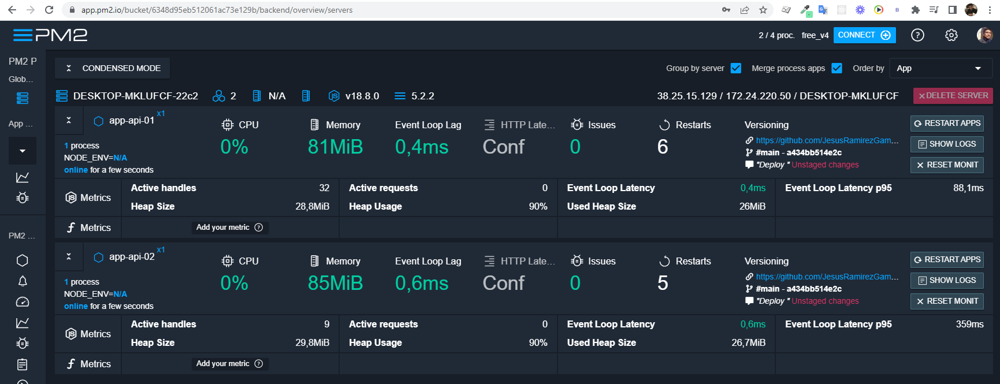

<p align="center">
  <p align="center">    
        
  </p>
  <p align="center">
       CoderHouse - Backend
  </p>
</p>

# load-balancer
Servidor con Balance de Carga

> Consigna: 
## PM2
1. Tomando con base el proyecto que vamos realizando, agregar un parámetro más en la ruta de comando que permita ejecutar al servidor en modo `fork` o `cluster`. Dicho parámetro será `FORK` en el primer caso y `CLUSTER` en el segundo, y de no pasarlo, el servidor iniciará en modo `fork`.
2. Agregar en la vista info, el número de procesadores presentes en el servidor.
3. Ejecutar el servidor (modos FORK y CLUSTER) con nodemon verificando el número de procesos tomados por node.
4. Ejecutar el servidor (con los parámetros adecuados) utilizando Forever, verificando su correcta operación. Listar los procesos por Forever y por sistema operativo.
5. Ejecutar el servidor (con los parámetros adecuados: modo FORK) utilizando PM2 en sus modos modo fork y cluster. Listar los procesos por PM2 y por sistema operativo.
6. Tanto en Forever como en PM2 permitir el modo escucha, para que la actualización del código del servidor se vea reflejado inmediatamente en todos los procesos.
7. Hacer pruebas de finalización de procesos fork y cluster en los casos que corresponda.

## NGINX  
1. Configurar Nginx para balancear cargas de nuestro servidor de la siguiente manera:
2.  Redirigir todas las consultas a /api/randoms a un cluster de servidores escuchando en el puerto 8081. El cluster será creado desde node utilizando el módulo nativo cluster.
3. El resto de las consultas, redirigirlas a un servidor individual escuchando en el puerto 8080.
4. Verificar que todo funcione correctamente.
5. Luego, modificar la configuración para que todas las consultas a /api/randoms sean redirigidas a un cluster de servidores gestionado desde nginx, repartiéndolas equitativamente entre 4 instancias escuchando en los puertos 8082, 8083, 8084 y 8085 respectivamente.
6. Incluir el archivo de configuración de nginx junto con el proyecto.

Nota : 
Incluir también un pequeño documento en donde se detallen los comandos que deben ejecutarse por línea de comandos y los argumentos que deben enviarse para levantar todas las instancias de servidores de modo que soporten la configuración detallada en los puntos anteriores.

Ejemplo:
```bash
pm2 start ./miservidor.js -- --port=8080 --modo=fork
pm2 start ./miservidor.js -- --port=8081 --modo=cluster
pm2 start ./miservidor.js -- --port=8082 --modo=fork
...

```
## PM2 _ answer


URL : https://app.pm2.io/bucket/6348d95eb512061ac73e129b/backend/overview/servers
```
pm2 plus
```
  <p align="center">    
        
  </p>


1. Se agrega sobre `config.js` las consideraciones para soportar el argumento : `MODO` considerando el default : `FORK`

```js
const {
    MODE,
    PORT,
    MODO,
    _
}= minimist(process.argv.slice(2),
            {
                alias:{e:"MODE",p:"PORT",m:"MODO"},
                default:{e:'DEV',p:8080,m:"FORK"}
            }
)
```

2. Agregamos sobre la vistas / router  previamente existente la visualizacion del numero de nucleos.

extraemos de `os.cpus` la cantidad de nucleos que tiene el servidor al momento de acceder al method `info`
```bash
import os from 'os';

const infodelProceso = {
  ...
   cantidadNucleos:  os.cpus().length,
  ...
``` 

sobre `info.hbs` visualizamos el resultado : 

```hbs
<p><b>Cantidad de núcleos:</b> {{data.cantidadNucleos}}</p>
```


3. Ejecutamos para verificar el funcionamiento de `FORK` y `CLUSTER`

Development environment
```bash
nodemon ./src/index.js -e=DEV -p=8080 -m=FORK
nodemon ./src/index.js --MODE=DEV --PORT=8080 --MODO=FORK
npm run dev
npm run dev -e=DEV -p=8080 -m=FORK
npm run dev --MODE=DEV --PORT=8080 --MODO=FORK

```
Production environment
```bash
node ./src/index.js -e=PROD -p=3000 -m=CLUSTER
node ./src/index.js --MODE=PROD --PORT=3000 --MODO=CLUSTER
npm start PROD
npm start PROD -e=PROD -p=3000 -m=CLUSTER
npm start PROD --MODE=PROD --PORT=3000 --MODO=CLUSTER
```
4. Verificamos resultados
Windows
```bash
tasklist /fi "imagename eq node.exe"
```
Linux
```bash
ps -axjf
ps -ef
```
5. para ejecutar el server utilizando los parametros de configuracion crearemos un ecosistema para hacer mucho mas sencilla la configuracion. Esta configuracion la colocaremos sobre : `ecosystem.config.cjs` para mas informacion : [ver mas](https://pm2.keymetrics.io/docs/usage/environment/)


```js
module.exports = {
    apps: [
        {
            name: 'app-api-01',
            script: 'src/index.js',
            watch: true,                    // true : la aplicacion se auto restart si existe un cambio en el directorio del app.
            max_memory_restart : '100M',    // Maximo de memoria, si es alcanzado el APP hace restart
            autorestart: true,
            // instances: 4,
            // args: '--PORT=8080',
        },
        {
            name: 'app-api-02',
            script: 'src/index.js',
            watch: true,
            autorestart: true,
            instances: '1',
            increment_var : 'PORT',         // Incrementa el PORT ( hasta encontrar disponible ) x cada instancia al iniciar o reiniciar.
            node_args: "--harmony",
            cron_restart : "59 23 * * *",   // Patron se reinicio 23:59 se auto restart.
            
            env: {
                "PORT": 8081,
                "MODE": "DEV"
            },
            env_production: {
                NODE_ENV: "PROD"
            }                        
            // args: '--PORT=8081',
        }//,
        // {
        //     script: './service-worker/',
        //     watch: ['./service-worker'],
        // },
    ],
};


```

eliminamos cualquier proceso ejecutanse sobre pm2
```bash
pm2 delete all
```


pm2 start ecosystem.config.cjs
```bash
PM2][WARN] Applications app01, app02 not running, starting...
[PM2] App [app01] launched (1 instances)
[PM2] App [app02] launched (12 instances)
┌─────┬──────────┬─────────────┬─────────┬─────────┬──────────┬────────┬──────┬───────────┬──────────┬──────────┬──────────┬──────────┐
│ id  │ name     │ namespace   │ version │ mode    │ pid      │ uptime │ ↺    │ status    │ cpu      │ mem      │ user     │ watching │
├─────┼──────────┼─────────────┼─────────┼─────────┼──────────┼────────┼──────┼───────────┼──────────┼──────────┼──────────┼──────────┤
│ 0   │ app01    │ default     │ 1.0.1   │ fork    │ 7153     │ 0s     │ 0    │ online    │ 18.8%    │ 46.6mb   │ jesus    │ enabled  │
│ 1   │ app02    │ default     │ 1.0.1   │ cluster │ 7152     │ 0s     │ 0    │ online    │ 18.8%    │ 47.1mb   │ jesus    │ enabled  │
│ 2   │ app02    │ default     │ 1.0.1   │ cluster │ 7202     │ 0s     │ 0    │ online    │ 18.8%    │ 45.1mb   │ jesus    │ enabled  │
│ 3   │ app02    │ default     │ 1.0.1   │ cluster │ 7212     │ 0s     │ 0    │ online    │ 12.5%    │ 45.0mb   │ jesus    │ enabled  │
│ 4   │ app02    │ default     │ 1.0.1   │ cluster │ 7237     │ 0s     │ 0    │ online    │ 12.5%    │ 44.9mb   │ jesus    │ enabled  │
│ 5   │ app02    │ default     │ 1.0.1   │ cluster │ 7248     │ 0s     │ 0    │ online    │ 31.3%    │ 44.6mb   │ jesus    │ enabled  │
│ 6   │ app02    │ default     │ 1.0.1   │ cluster │ 7259     │ 0s     │ 0    │ online    │ 25%      │ 46.3mb   │ jesus    │ enabled  │
│ 7   │ app02    │ default     │ 1.0.1   │ cluster │ 7270     │ 0s     │ 0    │ online    │ 18.8%    │ 42.2mb   │ jesus    │ enabled  │
│ 8   │ app02    │ default     │ 1.0.1   │ cluster │ 7281     │ 0s     │ 0    │ online    │ 12.5%    │ 42.0mb   │ jesus    │ enabled  │
│ 9   │ app02    │ default     │ 1.0.1   │ cluster │ 7294     │ 0s     │ 0    │ online    │ 12.5%    │ 42.0mb   │ jesus    │ enabled  │
│ 10  │ app02    │ default     │ 1.0.1   │ cluster │ 7305     │ 0s     │ 0    │ online    │ 0%       │ 41.7mb   │ jesus    │ enabled  │
│ 11  │ app02    │ default     │ 1.0.1   │ cluster │ 7316     │ 0s     │ 0    │ online    │ 0%       │ 41.0mb   │ jesus    │ enabled  │
│ 12  │ app02    │ default     │ 1.0.1   │ cluster │ 7327     │ 0s     │ 0    │ online    │ 0%       │ 38.9mb   │ jesus    │ enabled  │
└─────┴──────────┴─────────────┴─────────┴─────────┴──────────┴────────┴──────┴───────────┴──────────┴──────────┴──────────┴──────────┘
```

```bash
┌─ Process List ──────────────────────────────────────────┐┌──  app02 Logs  ────────────────────────────────────────────────────────────────────────┐
│[ 0] app01              Mem:  84 MB    CPU:  0 %  online ││ app02 > Servidor escuchando en el puerto 8082 - worker process with 7202 started       │
│[ 1] app02              Mem:  84 MB    CPU:  0 %  online ││ app02 > Servidor escuchando en el puerto 8082 - worker process with 9132 started       │
│[ 2] app02              Mem:  84 MB    CPU:  0 %  online ││ app02 > Servidor escuchando en el puerto 8082 - worker process with 9472 started       │
│[ 3] app02              Mem:  80 MB    CPU:  0 %  online ││                                                                                        │
│[ 4] app02              Mem:  80 MB    CPU:  0 %  online ││                                                                                        │
│[ 5] app02              Mem:  84 MB    CPU:  4 %  online ││                                                                                        │
│[ 6] app02              Mem:  85 MB    CPU:  0 %  online ││                                                                                        │
│[ 7] app02              Mem:  83 MB    CPU:  4 %  online ││                                                                                        │
│[ 8] app02              Mem:  83 MB    CPU:  0 %  online ││                                                                                        │
│[ 9] app02              Mem:  79 MB    CPU:  0 %  online ││                                                                                        │
│[10] app02              Mem:  87 MB    CPU:  0 %  online ││                                                                                        │
│[11] app02              Mem:  81 MB    CPU:  0 %  online ││                                                                                        │
│[12] app02              Mem:  82 MB    CPU:  0 %  online ││                                                                                        │
│                                                         ││                                                                                        │
└─────────────────────────────────────────────────────────┘└────────────────────────────────────────────────────────────────────────────────────────┘
┌─ Custom Metrics ────────────────────────────────────────┐┌─ Metadata ─────────────────────────────────────────────────────────────────────────────┐
│ Used Heap Size                               28.10 MiB  ││ App Name              app02                                                            │
│ Heap Usage                                     90.41 %  ││ Namespace             default                                                          │
│ Heap Size                                    31.08 MiB  ││ Version               1.0.1                                                            │
│ Event Loop Latency p95                         1.23 ms  ││ Restarts              2                                                                │
└─────────────────────────────────────────────────────────┘└────────────────────────────────────────────────────────────────────────────────────────┘
```

6.  Para soportar el comportamiento que permite actualizar automaticamente el aplicativo cuando se realice un cambio.

```js
// Watch and Restart app when files change
watch: true,
```

7. Finalizamos procesos ejecutados sobre pm2

pm2 delete all
```bash
[PM2] Applying action deleteProcessId on app [all](ids: [
   0, 1, 2, 3,  4,  5,
   6, 7, 8, 9, 10, 11,
  12
])
[PM2] [all](4) ✓
[PM2] [app02](8) ✓
[PM2] [app02](7) ✓
[PM2] [app02](6) ✓
[PM2] [app02](5) ✓
[PM2] [app02](3) ✓
[PM2] [app02](2) ✓
[PM2] [app02](1) ✓
[PM2] [app01](0) ✓
[PM2] [app02](9) ✓
[PM2] [app02](10) ✓
[PM2] [app02](12) ✓
[PM2] [app02](11) ✓
┌─────┬───────────┬─────────────┬─────────┬─────────┬──────────┬────────┬──────┬───────────┬──────────┬──────────┬──────────┬──────────┐
│ id  │ name      │ namespace   │ version │ mode    │ pid      │ uptime │ ↺    │ status    │ cpu      │ mem      │ user     │ watching │
└─────┴───────────┴─────────────┴─────────┴─────────┴──────────┴────────┴──────┴───────────┴──────────┴──────────┴──────────┴──────────┘
```

```bash
┌─ Process List ─────────────────────────┐┌──  app02 Logs  ────────────────────────────────────────────────────────────────────────────────┐
│                                        ││                                                                                                │
│                                        ││                                                                                                │
│                                        ││                                                                                                │
│                                        ││                                                                                                │
│                                        ││                                                                                                │
│                                        ││                                                                                                │
│                                        ││                                                                                                │
│                                        ││                                                                                                │
│                                        ││                                                                                                │
│                                        ││                                                                                                │
│                                        ││                                                                                                │
│                                        ││                                                                                                │
│                                        ││                                                                                                │
│                                        ││                                                                                                │
└────────────────────────────────────────┘└────────────────────────────────────────────────────────────────────────────────────────────────┘
┌─ Custom Metrics ───────────────────────┐┌─ Metadata ─────────────────────────────────────────────────────────────────────────────────────┐
│ Used Heap Size              27.53 MiB  ││ App Name              app02                                                                    │
│ Heap Usage                    89.29 %  ││ Namespace             default                                                                  │
│ Heap Size                   30.83 MiB  ││ Version               1.0.1                                                                    │
│ Event Loop Latency p95     1291.86 ms  ││ Restarts              22                                                                       │
└────────────────────────────────────────┘└────────────────────────────────────────────────────────────────────────────────────────────────
```

## NGINX _ answer

1. Instalacion NGINX : [ver mas](http://nginx.org/en/download.html)  version : 	`nginx/Windows-1.22.0`

2. configuracion : `nginx.conf` :

```
events {}

http {
    include       mime.types;
    default_type  application/octet-stream;

    upstream node_app{
        server 127.0.0.1:8080;
        server 127.0.0.1:8081 weight=4;
    }
    sendfile        on;
    keepalive_timeout  65;

    server {
        listen       80;
        server_name servername;

        #charset koi8-r;

        #access_log  logs/host.access.log  main;

        root ./servername/src/public;

        location / {
            try_files $uri $uri/ @express;
            # root   html;
            # index  index.html index.htm;
        }

        location @express{
            proxy_pass http://node_app;
        }

        error_page   500 502 503 504  /50x.html;
        location = /50x.html {
            root   html;
        }        
    } 
}

```

3. Accedemos a la URL : 

```url
http://localhost/api/randoms
```

4. 


```
┌─ Process List ─────────────────────────┐┌──  app02 Logs  ────────────────────────────────────────────────────────────────────────────────┐
│[ 0] app01      Mem:  83 MB    CPU:  1  ││ app02 > Servidor escuchando en el puerto 8081 - worker process with 13490 started              │
│[ 1] app02      Mem:  84 MB    CPU:  1  ││ app02 > Servidor escuchando en el puerto 8081 - worker process with 13973 started              │
│[ 2] app02      Mem:  84 MB    CPU:  1  ││ app02 > Servidor escuchando en el puerto 8081 - worker process with 14605 started              │
│[ 3] app02      Mem:  83 MB    CPU:  3  ││ app02 > Servidor escuchando en el puerto 8081 - worker process with 15414 started              │
│[ 4] app02      Mem:  86 MB    CPU:  1  ││ app02 > Servidor escuchando en el puerto 8081 - worker process with 15953 started              │
│[ 5] app02      Mem:  85 MB    CPU:  1  ││ app02 > Servidor escuchando en el puerto 8081 - worker process with 19944 started              │
│[ 6] app02      Mem:  84 MB    CPU:  3  ││ app02 > Servidor escuchando en el puerto 8081 - worker process with 20801 started              │
│[ 7] app02      Mem:  83 MB    CPU:  1  ││ app02 > Servidor escuchando en el puerto 8081 - worker process with 24543 started              │
│[ 8] app02      Mem:  83 MB    CPU:  1  ││ app02 > Servidor escuchando en el puerto 8081 - worker process with 25613 started              │
│[ 9] app02      Mem:  83 MB    CPU:  1  ││ app02 > Servidor escuchando en el puerto 8081 - worker process with 26073 started              │
│[10] app02      Mem:  83 MB    CPU:  0  ││ app02 > Servidor escuchando en el puerto 8081 - worker process with 27556 started              │
│[11] app02      Mem:  85 MB    CPU:  0  ││ app02 > Servidor escuchando en el puerto 8081 - worker process with 28203 started              │
│[12] app02      Mem:  83 MB    CPU:  0  ││ app02 > Servidor escuchando en el puerto 8081 - worker process with 28630 started              │
│                                        ││ app02 > Servidor escuchando en el puerto 8081 - worker process with 28987 started              │
└────────────────────────────────────────┘└────────────────────────────────────────────────────────────────────────────────────────────────┘
┌─ Custom Metrics ───────────────────────┐┌─ Metadata ─────────────────────────────────────────────────────────────────────────────────────┐
│ Used Heap Size              26.77 MiB  ││ App Name              app02                                                                    │
│ Heap Usage                    87.54 %  ││ Namespace             default                                                                  │
│ Heap Size                   30.58 MiB  ││ Version               1.0.1                                                                    │
│ Event Loop Latency p95        1.18 ms  ││ Restarts              12                                                                       
└────────────────────────────────────────┘└────────────────────────────────────────────────────────────────────────────────────────────────┘
```


NOTA : 

* Equivalentes [ver mas](https://stackoverflow.com/questions/31579509/can-pm2-run-an-npm-start-script)

Is there a way for pm2 to run an npm start script or do you just have to run pm2 start app.js

So in development
```bash
npm start
```
Then in production with pm2 you would run something like
```bash
pm2 start 'npm start'
```
There is an equivalent way to do this in forever:
```bash
forever start -c "npm start" ./
```

* support

PM2 now supports npm start:
```bash
pm2 start npm -- start
```
To assign a name to the PM2 process, use the --name option:
```bash
pm2 start npm --name "app name" -- start
```
* comandos [ver mas](https://pm2.keymetrics.io/docs/usage/application-declaration/)
```bash
# Start all applications
pm2 start ecosystem.config.js

# Stop all
pm2 stop ecosystem.config.js

# Restart all
pm2 restart ecosystem.config.js

# Reload all
pm2 reload ecosystem.config.js

# Delete all
pm2 delete ecosystem.config.js
```


* Run  [ver mas])(https://stackoverflow.com/questions/31579509/can-pm2-run-an-npm-start-script)
  
  pm2 start "npm run start" 

```js
module.exports = {
    apps: [
        {
            name: 'app-api-01',
            script: 'src/index.js',
            watch: true,                    // true : la aplicacion se auto restart si existe un cambio en el directorio del app.
            max_memory_restart : '100M',    // Maximo de memoria, si es alcanzado el APP hace restart
            autorestart: true,
            // instances: 4,
            // args: '--PORT=8080',
        },
        {
            name: 'app-api-02',
            script: 'src/index.js',
            watch: true,
            autorestart: true,
            instances: '1',
            increment_var : 'PORT',         // Incrementa el PORT ( hasta encontrar disponible ) x cada instancia al iniciar o reiniciar.
            node_args: "--harmony",
            cron_restart : "59 23 * * *",   // Patron se reinicio 23:59 se auto restart.
            
            env: {
                "PORT": 8081,
                "MODE": "DEV"
            },
            env_production: {
                NODE_ENV: "PROD"
            }                        
            // args: '--PORT=8081',
        }//,
        // {
        //     script: './service-worker/',
        //     watch: ['./service-worker'],
        // },
    ],
};
```
pm2 start ecosystem.config.cjs  --only app01
pm2 start ecosystem.config.cjs --env PROD --only app01
pm2 start ecosystem.config.cjs --env PROD --only app01